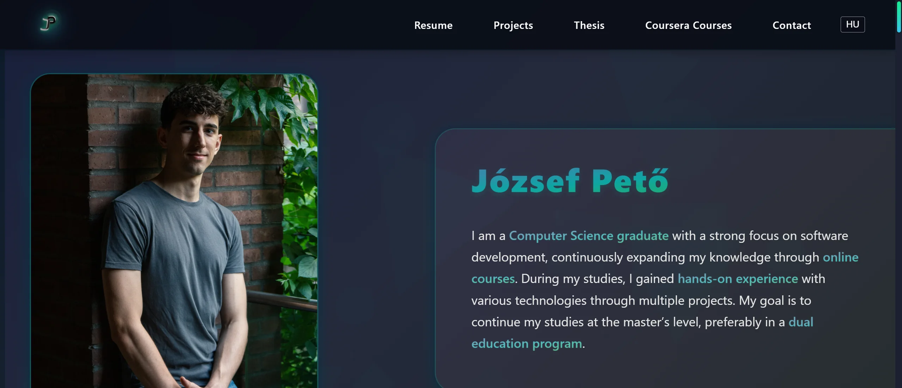

# József Pető — Portfolio Website

An interactive, multilingual portfolio website showcasing my resume, projects, and thesis in one place.



## Features

- Responsive design (mobile to desktop)
- Hungarian / English language toggle (persisted in localStorage)
- Project timeline grouped by year
- Project image gallery with modal, keyboard and swipe navigation
- Thesis slide viewer with swipe support
- Animated splash screen with critical image preloading
- Scroll-based reveal animations and scroll progress bar
- Parallax background effects (particles and geometric shapes)
- Hero section parallax (mouse-driven 3D rotation)
- Section titles with per-character stagger animation

## Technologies

- **HTML**
- **CSS**
- **JavaScript**

## File Structure

```
project/
├── index.html
├── css/
│   ├── style.css        # Import aggregator
│   ├── base.css         # Variables, splash screen, background particles
│   ├── header.css       # Header, navigation, hamburger menu
│   ├── hero.css         # Hero section, responsive breakpoints
│   ├── sections.css     # Shared section styles, thesis slider, CTA button
│   ├── projects.css     # Project cards, timeline
│   ├── footer.css       # Footer, social links, course cards
│   └── modal.css        # Project lightbox modal
├── js/
│   ├── main.js          # Entry point, module initialization
│   ├── data.js          # Translations, app state, thesis slide images
│   ├── utils.js         # Shared helpers ($$, randomBetween, image preloader)
│   ├── i18n.js          # Hungarian / English language switching
│   ├── ui.js            # Hamburger, smooth scroll, reveal, parallax
│   ├── background.js    # Background particles and geometric shapes
│   ├── splash.js        # Splash screen animation and removal
│   ├── modal.js         # Project gallery lightbox
│   └── thesis.js        # Thesis slide viewer
├── assets/
│   ├── Projekts/        # Project gallery images (.webp)
│   ├── CV/              # CV PDFs and preview images
│   ├── Thesis/
│   │   ├── HU/          # Hungarian thesis slides
│   │   └── EN/          # English thesis slides
│   └── Coursera/        # Course certificate images
└── README.md
```

## Setup

```bash
git clone <repo-url>
```

No build step or dependencies required, open `index.html` in a browser, or serve it with any static server (e.g. VS Code Live Server).

> **Note:** ES Modules require the file to be served over HTTP(S), not opened via `file://`. Any static server or Live Server works out of the box.


---


# Pető József — Portfólió weboldal

Interaktív, többnyelvű portfólió weboldal, amely egy helyen mutatja be az önéletrajzom, projektjeimet és szakdolgozatomat.

## Funkciók

- Reszponzív design (mobiltól asztaliig)
- Magyar / angol nyelvváltás (localStorage-ba mentve)
- Projekt idővonal évek szerint csoportosítva
- Projekt galéria modal ablakkal, billentyűzetes és swipe navigációval
- Szakdolgozat dia-lapozó, swipe támogatással
- Animált splash screen kritikus képek előtöltésével
- Görgetés-alapú reveal animációk és scroll progress sáv
- Parallax háttéreffektek (résecskék, geometriai formák)
- Hero parallax (egérmozgás alapú 3D elforgatás)
- Szekciócímek karakterenkénti animációval

## Technológiák

- **HTML**
- **CSS**
- **JavaScript**

## Fájlszerkezet

```
project/
├── index.html
├── css/
│   ├── style.css        # Import összesítő
│   ├── base.css         # Változók, splash screen, háttér-résecskék
│   ├── header.css       # Fejléc, navigáció, hamburger menü
│   ├── hero.css         # Hero szekció, reszponzív töréspontok
│   ├── sections.css     # Közös szekció stílusok, szakdolgozat, CTA gomb
│   ├── projects.css     # Projekt kártyák, idővonal
│   ├── footer.css       # Lábjegyzet, social linkek, kurzus kártyák
│   └── modal.css        # Projekt lightbox modal
├── js/
│   ├── main.js          # Belépési pont, modulok inicializálása
│   ├── data.js          # Fordítások, alkalmazás állapot, dia képek
│   ├── utils.js         # Közös segédfüggvények ($$, randomBetween, preloader)
│   ├── i18n.js          # Magyar/angol nyelvváltás
│   ├── ui.js            # Hamburger, smooth scroll, reveal, parallax
│   ├── background.js    # Háttér-résecskék és geometriai formák
│   ├── splash.js        # Betöltőképernyő animáció és eltávolítás
│   ├── modal.js         # Projekt galéria lightbox
│   └── thesis.js        # Szakdolgozat dia-lapozó
├── assets/
│   ├── Projekts/        # Projekt galéria képek (.webp)
│   ├── CV/              # Önéletrajz PDF-ek és előnézeti képek
│   ├── Thesis/
│   │   ├── HU/          # Magyar szakdolgozat diák
│   │   └── EN/          # Angol szakdolgozat diák
│   └── Coursera/        # Kurzus tanúsítvány képek
└── README.md
```

## Telepítés

```bash
git clone <repo-url>
```

Nincs build lépés vagy függőség, nyisd meg az `index.html` fájlt egy böngészőben, vagy szolgáld ki egy statikus szerverrel (pl. VS Code Live Server).

> **Megjegyzés:** Az ES Modules miatt a fájlt HTTP(S) protokollon kell megnyitni, nem `file://`-on. Live Serverrel vagy bármilyen statikus szerverrel azonnal működik.